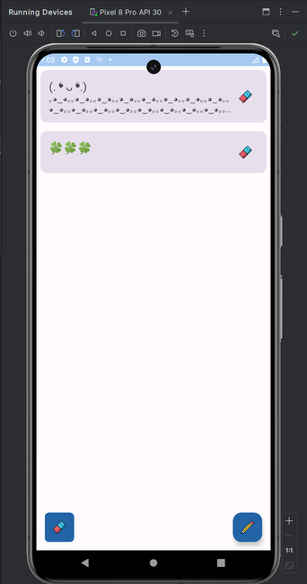

# Mood Diary           

## Описание
Mood Diary — это приложение для отслеживания настроения и записи заметок, отражающих ваши чувства в разные дни. Приложение позволяет пользователям регистрировать свои настроения и добавлять текстовые заметки, а также просматривать и управлять историей записей.

## Основные свойства
- **Регистрация настроения**: Легко добавляйте заметки, описывающие ваше настроение и чувства.
- **Управление заметками**: Возможность редактировать и удалять заметки.
- **История**: Просматривайте свою историю записей при помощи удобного списка.
- **Анимированные интерфейсы**: Уникальные анимации для улучшения пользовательского опыта.  
 

      
 

## Архитектура
Проект построен на основе архитектурного паттерна MVVM (Model-View-ViewModel), что позволяет отделить бизнес-логику от пользовательского интерфейса. Основные компоненты приложения:

1. **Model**:
    - `MoodNote` — модель данных для хранения информации о заметках.
    - `MoodDatabase` — класс для управления локальной базой данных с помощью Room.

2. **ViewModel**:
    - `MoodViewModel` — управление состоянием UI и взаимодействие с моделью данных.

3. **View**:
    - Набор экранов (HomeScreen, AddEditScreen, HistoryScreen), реализованных с помощью Jetpack Compose.
    - Навигация через `NavHostController`.

4. **UI Components**:
    - Кастомные компоненты интерфейса, такие как `MoodNoteCard`, `CustomTextField`, и анимационные элементы.

## Используемые технологии
- **Kotlin** — язык программирования.
- **Jetpack Compose** — библиотека для создания UI.
- **Room** — библиотека для работы с локальной базой данных.
- **Coroutines** — для работы с асинхронными операциями.

## Преимущества
- **Простой и интуитивно понятный интерфейс**: Удобные элементы управления для регистрации и отображения заметок.
- **Легкость в использовании**: Быстрое добавление, редактирование и удаление заметок.
- **Анимированные элементы**: Увлекательный интерфейс за счет анимаций, поддерживающий динамичный опыт пользователя.
- **Сохранение данных**: Надежная работа с локальной базой данных обеспечивает сохранение заметок даже после закрытия приложения.

## Варианты улучшений
1. **Темная тема**: Добавление поддержки темной темы для улучшения восприятия в условиях недостаточного освещения.
2. **Напоминания**: Возможность добавления напоминаний о необходимости записать настроение.
3. **Графики**: Визуализировать изменения настроения со временем с помощью графиков и диаграмм.
4. **Анализ настроения**: Использовать алгоритмы анализа для предоставления рекомендаций на основе введенных данных.
5. **Экспорт/Импорт данных**: Возможность резервного копирования и восстановления данных, например, в формате CSV.

## Установка
1. Склонируйте этот репозиторий на свой локальный компьютер.
2. Откройте проект с помощью Android Studio.
3. Соберите и запустите приложение на эмуляторе или реальном устройстве.

